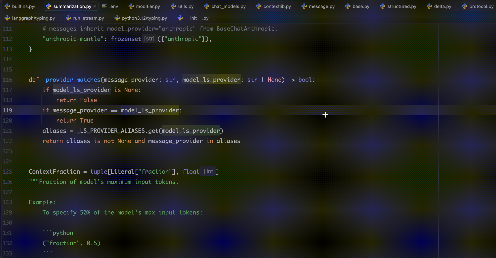

<div align="right">

中文 | [English](README_EN.md)

</div>

# Programming Language Comparison

在 JetBrains IDE 内，把选中的代码实时类比成其他语言（Python → Java、Go → Java、Node.js → Java ……），由任意 OpenAI 格式的 LLM 驱动。



## ✨ 功能

- **选区实时类比**：选中代码，翻译结果流式显示在选区正下方；源语言自动检测，也可手动指定
- **自动去除注释**：翻译结果不包含原代码中的注释，只保留纯代码
- **多目标语言并行**：Java / Go / Kotlin / TypeScript …… 同时翻译；结果缓存，重复选中秒出
- **任意 OpenAI 格式服务**：bigmodel、OpenAI、DeepSeek、Moonshot、Qwen、One-API/New-API 网关等
- **工具窗口镜像**：`LangCompare` 工具窗口按目标语言分页展示，方便复制
- **代理支持**：可在插件内配置代理，或继承 IDE/系统代理

## 📦 安装

```bash
./gradlew buildPlugin
# 产物：build/distributions/programming-lang-comparison-idea-plugin-<version>.zip
```

在 IDE 中：`Settings → Plugins → ⚙ → Install Plugin from Disk` 选择该 zip。

> 需要 IntelliJ Platform 2025.1+。首次构建会下载 IDEA Community 发行版，耗时较长。

## 🚀 使用

1. 打开 `Settings → Tools → Language Comparison`，填写 **Base URL / API Key / Model**
2. 在编辑器中选中一段代码，稍候即自动翻译；也可右键 `Compare to Other Languages` 手动触发
3. 清空选区或右键 `Clear Language Comparison` 清除结果
4. 底部 `LangCompare` 工具窗口可查看并复制完整翻译

> 快捷键：默认无绑定，可在 `Settings → Keymap` 中为 `Compare to Other Languages` / `Clear Language Comparison` 分配（如 `⌃⌘Z` / `⌃⌘X`）。

## ⚙️ 配置项

| 配置 | 说明                                                                                                    |
| --- |---------------------------------------------------------------------------------------------------------|
| Base URL | OpenAI 兼容接口地址（含 `/v1`），如 `https://open.bigmodel.cn/api/paas/v4`、`https://api.openai.com/v1` |
| API Key | 对应服务的密钥（存入 IDE 凭据库，不写明文）                                                             |
| Model | 模型名，如 `glm-5.3-flash`、`deepseek-flash`                                                            |
| HTTP Proxy | 可选，LLM 请求专用代理（如 `http://127.0.0.1:7890`）；支持 `direct` 强制直连；留空继承 IDE/系统代理     |
| Source language | 源语言覆盖（可选），如 `Python`、`Node.js`；留空自动检测                                                |
| Target languages | 目标语言列表（逗号分隔），如 `Java, Go, Kotlin, TypeScript, Rust`                                       |
| Translate automatically | 选中代码时自动翻译（关闭后仅手动触发）                                                                  |
| Debounce (ms) | 自动触发防抖间隔（200–10000）                                                                           |
| Use streaming responses | 流式返回，边生成边显示                                                                                  |

## ❓ FAQ

- **响应慢？** 换轻量模型是最大的提速手段（如 `glm-5.3-flash`）；选区尽量精简；插件已内置流式渲染、并行请求、结果缓存与连接复用。
- **TLS handshake failed？** 该错误会标注实际连接方式 `[connection: ...]`：访问可直连的服务却走了代理时，填 `direct` 强制直连；访问需代理的服务（如 api.openai.com）则配置 HTTP Proxy。
- **想用 ChatGPT 订阅？** 订阅不能直接当 API 用，需通过 One-API/New-API 等网关转成 OpenAI 格式后填 Base URL。
- **401 / model not found？** 检查 API Key 权限，以及模型名与 Base URL 是否配套。

## 🛠️ 开发

```bash
./gradlew runIde   # 启动沙箱 IDE 试用
```

- 环境：JDK 21；IntelliJ Platform Gradle Plugin 2.5.0 + 平台 2025.1
- 结构：`editor/` 选区监听与编排（核心）、`llm/` OpenAI 格式客户端（SSE 流式）、`settings/` 配置与 Settings UI、`ui/` 工具窗口、`actions/` 右键菜单
